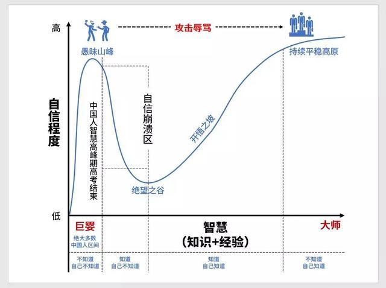

## 达克效应

### 一、简介

达克效应是一种认知偏差效应，指的是能力欠缺的人在自己欠缺能力的基础上得出自己认为正确但其实错误的结论，行为者无法正确认识到自身的不足，辨别错误行为。这些能力欠缺者们沉浸在自我营造的虚幻的优势之中，常常高估自己的能力水平，却无法客观评价他人的能力。

达克效应全称为邓宁-克鲁格效应，邓宁和克鲁格因为提出这个现象获得2000年诺贝尔心理学奖，他们的研究发现：

1. 能力差的人通常会高估自己的技能水平；
2. 能力差的人不能正确认识到其他真正有此技能的人的水平；
3. 能力差的人无法认知且正视自身的不足，及其不足之极端程度；
4. 如果能力差的人能够经过恰当训练大幅度提高能力水平，他们最终会认知到且能承认他们之前的无能程度。

这个印证了达尔文的一句名言：无知要比博学更容易产生自信。

下面这张图充分说明了达克效应，知识和自信的曲线。

这张图可以划分为4个阶段：

1. 不知道自己不知道：在刚开始接触这个领域，人们很容易出现无知者无畏，初生牛犊不怕虎的倾向，随之产生迷之自信；
2. 知道自己不知道：随着学习不断深入，大多数人会逐渐发现自己的不足；
3. 知道自己知道：在经历消沉和重新定位之后才终于对自己的能力有比较准确的认识，随着继续深入学习经验和知识不断提高；
4. 不知道自己知道：在某个领域的打到顶峰的人会进入一个平稳的状态并一直保持下去。

### 二、案例

在学校晚会上说话几段相声的材料学博士生，自认为可以比肩有几十年经验的相声名家，声称要彻底推翻传统相声。

宅在宿舍，吃着泡面，喝着快乐水的学生，前一秒还在呐喊“IG牛逼”，下一秒就对带IG的老板满脸不屑。

活跃在各个论坛的大神经常刚学会一句话就对专业学者口诛笔伐。

这样的例子在生活中比比皆是。为什么人们在自己不擅长的领域有迷之自信呢？邓宁克鲁格的研究就说明了越无能的人越会认为自己无所不能。我们仔细想想，也有道理，在某个领域能力差的人，往往缺少对这个领域全面而深刻的认知，所以他们根本不知道自己有哪些不足，也不知道别人比自己优秀在哪里，所以才产生了一种迷之自信，沉浸在了虚幻的优越感中。

总之，自信是好事，但盲目自信往往成为阻碍自己进步的障碍，把自信建立在准确评估自己能力的基础上，才是我们追求的目标。