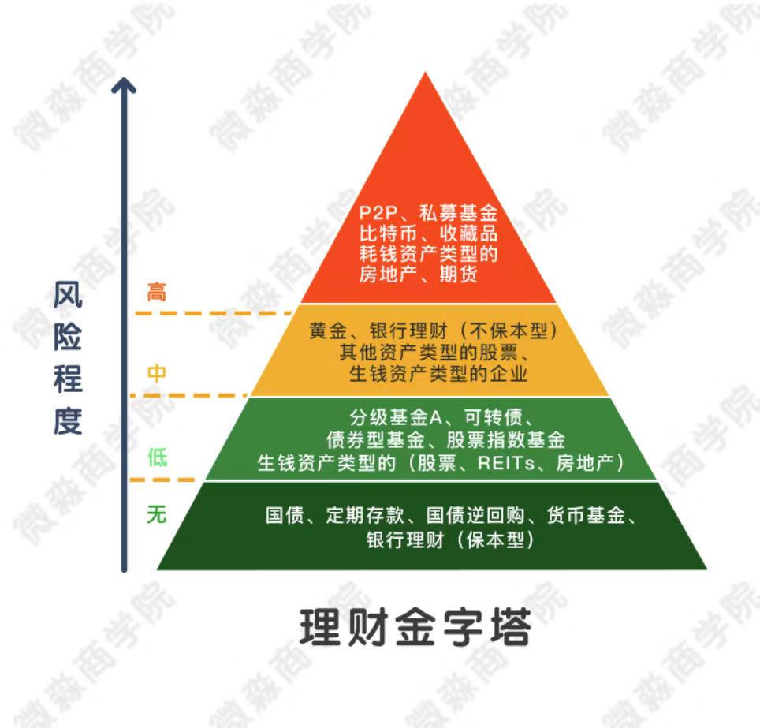

## 理财工具

下面这张图基本涵盖了所有的理财工具和风险程度：

### 第一层：无风险投资

年化收益率一般在3% - 5%之间。下面介绍一下这几种理财工具。

- 定期存款：这个就不用说了，就是存银行的定期。
- 货币基金：也比较常见，比如余额宝，在证券app里面有多种可以选择。

- 银行理财（保本型）：是银行卖的保本型理财产品。这里提示一下如果要买这个一定要注意是不是保本型。很多时候漂亮小姐姐热情推荐下，会忽略是不是保本型的，如果买到了不是保本型的产品也是可能会大幅亏损的。
- 国债：国债就是国家借钱开的借条。只要国家还在，这个钱就会还的，所以安全性没的说。
- 国债逆回购：本质就是国债抵押借款。手里有国债但是缺钱的人把国债抵押了借钱。手里有钱的人把钱借出去。比如小A手里有10万元，小B手里有11万元的国债。小B把11万的国债抵押了，小A把10万元借给小B。如果到期了小B没有还钱，那么11万国债就会被卖掉还给小A。因为国债是没有风险的，所以小A也是没有风险的。有时候市场缺钱，借钱不容易的时候，7天的逆回购年化利率可能高达20%左右。比如**131800**就是一只国债逆回购，最大的数字不是价格而是年华收益率。

### 第二层：低风险投资

低风险理财工具可以细分为两类。一类是低风险中等收益，年化收益率一般在6% - 15%之间，主要包括分级基金A、可转债、债券基金、股票指数基金。一类是低风险高收益，年化收益率一般在15% - 30%之间，主要包括生钱资产类型的股票、REITs、房地产。

- 生钱类型的股票：就是持续分红的股票，涨跌都有分红，不断有现金流入的股票。每年分红收益率越高越优质，优质的生钱类型的股票，每年的分红收益率可以高达10%以上。那么怎么找出这样的股票呢？其实很简单，只要能够读懂财报就可以了。在股票行情数据中**股息率**就代表了分红收益率。
- REITs：是房地产投资信托基金。生钱类型的REITs，是持续高分红的REITs，其实一般REITs都是高分红的。因为国家法律都规定REITs每年至少要把90%以上的利润分配给投资者。投资REITs本质上就是投资房地产，普通的投资房地产成本太高，没有个50多万都买不起一套房，REITs给了所有人投资当地产的机会。比如**PSA**就是一种REITs代码。
- 分级基金A：分级基金A是一种把钱借给分级基金B以获取利息的基金，分级基金B以自己的本金做担保偿还A的本金和利息。所以分级基金A的投资者没有信用风险还能获得每年5%以上的分红。以低于一元的价格买入分级基金A还可以获得无风险的价格收益，分级基金A的年化收益率一般可以达到8% - 15%。比如**银行A（150227）**就是分级基金A的一种。
- 可转债：可以转换成股票的债券，在100元以下买进高信用等级的可转债没有风险，股市上涨的时候还能获得超额收益，是一种收益下有保底，上不封顶的投资工具，一般90元以下买进，年化收益率可以达到10% - 20%。比如123001就是一只可转债。
- 股票指数基金：复制股票指数的股票基金。由于股票指数具有永生不死，长期上涨的特点。在合适的价位买入股票指数基金长期持有，几乎没有风险，其年化收益率一般在10% - 15%之间。比如**510300**就是一只沪深300指数基金，股票指数基金的一种。

### 第三层：中风险投资

中风险投资主要有4个：黄金、银行理财（不保本型）、其他资产类型的股票、生钱资产类型的企业。

- 黄金：大家很熟悉，但为什么是中风险呢？因为黄金是其他资产，不带来净现金流入。持有黄金只能赚差价，价差的涨跌有很大的不确定性，所以是中风险。
- 银行理财（不保本型）：有风险，需谨慎，一般有理财知识的人不会参与。
- 其他资产类型的股票：不分红的股票，这类股票不分红，买了这种股票只能靠未来的价格上涨来赚钱。但是未来价格的涨跌有很大的不确定性。其实股票可以是低风险高收益，高风险高收益，高风险高亏损的理财工具。对于拥有不同理财知识的人才会一味认为股票是高风险的投资工具。
- 生钱资产类型的企业：就是持续赚钱的企业。一般生钱资产类型的企业风险是大于生钱资产类型的股票的。因为上市发行的公司都是行业中排名前几的公司，风险小于中小企业。即使已经赚钱的中小企业，风险相对还是较大的。这也是很多人找工作都想进大公司的原因。

### 第四层：高风险投资

常见的高风险理财工具有一下几个，这里再强调一下，高风险并不代表着高收益，一般情况下对应的都是高亏损。

- P2P：本质是在互联网放高利贷的，这种不是在国家交易所交易的标准化理财工具。风险很大，容易血本无归。
- 私募基金：面向少数人募集成立的基金，可以投资各种理财工具，私募基金是非标准化的理财工具，风险很大。
- 比特币：一种数字货币，不是在国家交易所交易的标准化理财工具，本身也不产生现金流，属于其他资产，只能赚差价，风险很大。
- 收藏品：不是在国家交易所交易的标准化理财工具，本身也不产生现金流，属于其他资产，只能赚差价，并且变现很不容易，风险很大。
- 耗钱资产类型的房地产：持续带来净现金流出的房地产，因为每月的净现金流出是确定的，也就是说每个月的亏损是确定的，只能靠未来的放假上涨赚钱，具有很大的不确定性，风险比较高。
- 期货：在期货交易所交易的标准化的合约，没有信用风险，不会跑路，期货本身不产生现金流，只能靠未来的价差赚钱，有很大的不确定性，另外期货一般都有高杠杆，很容易亏完本金，风险很大。

对于高风险理财工具，我们了解一下就行，尽量不去碰。因为高风险 != 高收益，反而往往会带来高亏损。

### 四种风险的投资工具总结

在实现财务自由的过程中，主要用好无风险和低风险的理财工具就可以了。在这两种风险的理财工具中，有两个理财工具最重要，对我们未来实现财务自由有巨大的帮助，这两个工具就是**生钱资产类型的股票**和**REITs**。只要学精了这两个理财工具，未来成为有钱人不是梦想，经过长期的实践证明，这两个工具是男女老少躺赚的最佳工具。

不过要想短期内暴富的话，这两个理财工具就不能满足了，这就需要企业这个工具了。

企业、股票和REITs是实现财务自由的核心工具，这三个工具组合会产生源源不断的现金流，这三大核心工具，只要用好了一个就能脱贫致富，用好了企业这个工具，你会成为企业家；用好了股票或REITs这个工具，你会成为投资家，用好了企业、股票、房地产这三个工具，你会成为资本家。

这些理财工具的购买渠道有银行、基金公司、其他代销机构、证券公司。前三个的手续费一般都比证券公司高，比如：银行：万分之72左右，基金公司：万分之60左右，其他代销机构：万分之12左右。而通过证券账户一般不会超过万分之8，有的甚至低于万分之3。

### 证券开户常见的坑

- 高佣金：佣金就是手续费的意思，买卖股票，每一次交易都需要支付佣金，虽然证券公司收费受国家监管，但是国家之规定了收费最高标准--千分之三，也就是万分之30，如此一来不同的证券公司的手续费就不一样了。现在佣金超过万分之10的证券公司都是耍流氓，直接淘汰。万分之3到万分之6是一个合理的区间，根据客户资金量不同，证券公司会有不同的收费标准，一般5万以下的资金，佣金在万分之5以上，20万以上的资金有可能谈到万分之3。开户时候的佣金越便宜，我们的交易成本就越低。聪明的做法就是在实力强大的的大券商中选佣金最低的那一家开户。
- 杂费：在我们的交易中，除了佣金还有经手费和监管费，这个被称为规费。有诚意的券商会将这些规费包含在万分之3的手续费中，但很多券商另外收取，并且不告诉你，默默扣钱，所以开户的时候一定要资讯客户经理，佣金是否包含规费。尽量选择那些没有杂费的券商。
- 叠加套餐：有些叠加套餐会赠送一些资讯等，往往这就意味着你的佣金会贵很多，有些叠加套餐对应万分之30的佣金！开户的时候不要选择叠加套餐。

### 重点

【重点一】：无风险的投资工具，尤其关注国债逆回购、货币基金，也就是捡钱小秘密。

【重点二】：低风险投资工具，尤其是生钱资产类型的股票、REITs。

【重点三】：我们实现财务自由的三个核心工具——股票、REITs、企业。

