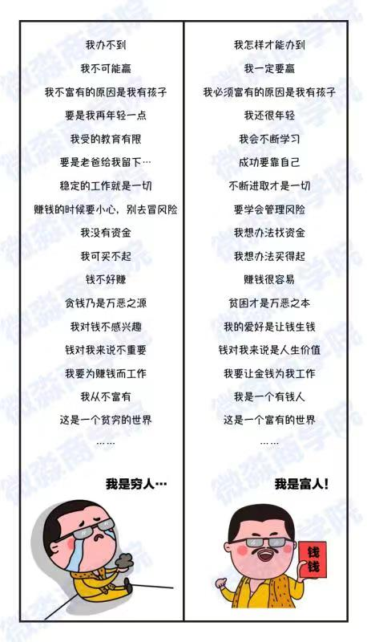

找到什么是行之有效的，那么就去做吧！ ---- 李光耀

当一个人的单位时间价值较高时，就会更在意时间，并且会倾向用金钱去置换时间。反过来说，当一个人的单位时间较低时，就会显得无所事事，看起来时间很多，但是都虚耗在低价值的事上面了。

“复利”被爱因斯坦称为第八大奇迹。

总资产 = 本金 * （1 + 收益率）^ N。

穷人和中产为什么不能跨越阶层呢？因为他们懒，懒得学习，懒得行动，懒得努力。贫穷的原因很大一部分是因为懒惰，这种懒惰不仅是身体上的懒惰，更是思维上的懒惰。他们虽然知道钱放在银行会贬值，会让通货膨胀吃掉，但是他们懒得行动，不愿意花费一些时间改变自己，每天躺在舒适区，有天父母需要养老金，孩子教育需要一大笔钱，自己生病需要一大笔钱的时候，就悔之晚矣了。

从本质上讲，贫富的差别其实是思维方式的差别，只有拥有了富人思维才能做到事半功倍。下面两张图片展示了穷人思维和富人思维的差异。

【富人思维第一条】

提升理财技能，实现财富独立，可以获得更多的自主选择的权利，获得给家人更好的生活的能力。

【富人思维第二条】

量化思维，有数据支撑的逻辑比拍脑门决策要靠谱的多。