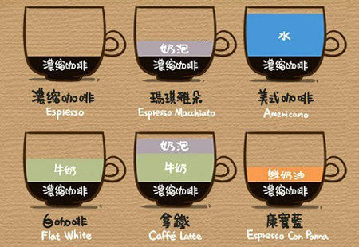
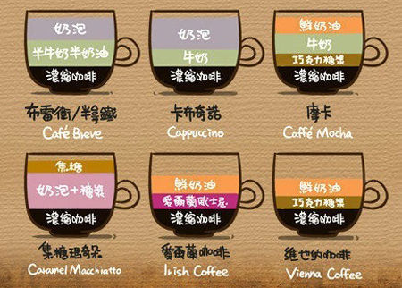

## 咖啡种类介绍

| 咖啡种类      | 简介                                                         | 主要成分                            |
| ------------- | ------------------------------------------------------------ | ----------------------------------- |
| 浓缩咖啡      | 原文是意大利语，有“立即为你煮”的意思，是俗称的意大利特浓咖啡。浓缩咖啡是利用高压，让沸水在短短几秒里迅速通过咖啡粉，得到约1/4盎司的咖啡，味苦而浓香。 | 纯咖啡                              |
| 玛奇朵        | Macchiato原文为意大利语，代表“印记、烙印”的意思，发音为“玛奇雅朵”，但我们习惯称呼它玛奇朵。玛奇朵是在浓咖啡上加上薄薄一层热奶泡以保持咖啡温度，细腻香甜的奶泡能缓冲浓缩咖啡带来的苦涩冲击，想喝咖啡但又无法舍弃甜味的你，可以选择玛奇朵。 | 纯咖啡 + 奶泡                       |
| 美式咖啡      | 使用滴滤式咖啡壶、虹吸壶、法压壶之类的器具所制作出的黑咖啡，又或者是在意大利浓缩咖啡中加入大量的水制成。口味比较淡，但因为萃取时间长，所以咖啡因含量高。 | 纯咖啡 + 水                         |
| 白咖啡        | 马来西亚土特产，约有100多年的历史。白咖啡并不是指咖啡的颜色是白色的，而是采用特等咖啡豆及特级脱脂奶精原料，经特殊工艺加工后得到的咖啡，甘醇芳香不伤肠胃，保留了咖啡原有的色泽和香味，颜色比普通咖啡更清淡柔和，故得名为白咖啡。 | 纯咖啡 + 牛奶                       |
| 拿铁          | 拿铁咖啡做法极其简单，就是在刚刚做好的意大利浓缩咖啡中倒入接近沸腾的牛奶。事实上，加入多少牛奶没有一定之规，可依个人口味自由调配。 | 纯咖啡 + 牛奶 + 奶泡(少量)          |
| 康宝蓝        | 意大利语中，Con是搅拌，Panna是生奶油，康宝蓝即意式浓缩咖啡加上鲜奶油。有一种说法是，正宗的康宝蓝要配一颗巧克力或太妃糖，先将巧克力或太妃糖含在嘴里，再喝咖啡，让美味一起在口中绽放。 | 纯咖啡 + 鲜奶油                     |
| 布雷卫/半拿铁 | 很像拿铁，不同是加入了的不是牛奶，而是半牛奶、半奶油的混合物，有时会再加少许奶泡。 | 纯咖啡 + 半牛奶半奶油 + 奶泡        |
| 卡布奇诺      | 传统的卡布奇诺咖啡是三分之一浓缩咖啡，三分之一蒸汽牛奶和三分之一泡沫牛奶。卡布奇诺分为干和湿两种。干卡布奇诺(Dry Cappuccino)是指奶泡较多，牛奶较少的调理法，喝起来咖啡味浓过奶香。湿卡布奇诺(Wet Cappuccino)则指奶泡较少，牛奶量较多的做法，奶香盖过浓呛的咖啡味，适合口味清淡者。 | 纯咖啡 + 牛奶(少量) + 奶泡          |
| 摩卡          | 一种最古老的咖啡，得名于著名的摩卡港。摩 卡是由意大利浓缩咖啡、巧克力糖浆、鲜奶油和牛奶混合而成的，是意式拿铁咖啡的变种。 | 纯咖啡 + 巧克力糖浆 + 牛奶 + 鲜奶油 |
| 焦糖玛奇朵    | 即加了焦糖的玛奇朵，是在香浓热牛奶上加入浓缩咖啡、香草，最后淋上纯正焦糖而制成的饮品，特点是在一杯饮品里可以喝到三种不同的口味。 | 纯咖啡 + 奶泡糖浆 + 焦糖            |
| 爱尔兰咖啡    | 一种既像酒又像咖啡的咖啡，是由热咖啡、爱尔兰威士忌、奶油、糖混合搅拌而成。 | 纯咖啡 + 爱尔兰威士忌 + 鲜奶油      |
| 维也纳咖啡    | 奥地利最著名的咖啡，在温热的咖啡杯底部撒上薄薄一层砂糖或细冰糖，接着向杯中倒入滚烫而且偏浓的黑咖啡，最后在咖啡表面装饰两勺冷的新鲜奶油，一杯维也纳咖啡就做好了。 | 纯咖啡 + 巧克力糖浆 + 鲜奶油        |

> 参考：
>
> https://zhuanlan.zhihu.com/p/35882268